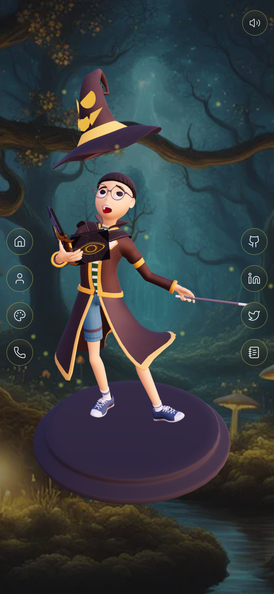

# Muhammad Zain Akram | Creative Developer Portfolio 🔥

&nbsp;&nbsp;
&nbsp;&nbsp;
&nbsp;&nbsp;<br />

This repository contains the **source code** for my personal creative portfolio website, built using **Next.js**, **Three.js**, and **Tailwind CSS**. <br />

Check out the live site here 👇: <br />
[Zain Akram — Portfolio Website](https://zain-portfolio-2tpo-zeta.vercel.app/) <br />

---

## 👋 About Me

I'm **Muhammad Zain Akram**, a [YAHAN APNI ROLE/TAGLINE LIKHO — jaise "Full Stack Developer" ya "MERN Stack Developer"]. This portfolio showcases my work, skills, and projects through an interactive 3D experience.

- 🌐 Portfolio: [https://zain-portfolio-2tpo-zeta.vercel.app/]
- 💼 LinkedIn: [https://www.linkedin.com/in/muhammad-zain-akram-/]
- 🐦 Twitter/X: [https://x.com/codebyzain]
- 📧 Email: [zainakram.work4@gmil.com]
- 🐙 GitHub: [https://github.com/zainakramwork4]

---

## Images of The Portfolio Website

#### Home


#### About


#### Projects


#### Contact


#### Mobile Version



> ⚠️ Note: Upar wali image paths abhi placeholder hain — apne actual screenshots `public/website-images/` folder mein daal ke path match kar lena.

---

## Tech Stack

- **Framework:** Next.js 16 (React 19)
- **3D Graphics:** Three.js, @react-three/fiber, @react-three/drei
- **Styling:** Tailwind CSS 4
- **Animations:** Framer Motion
- **Forms:** React Hook Form
- **Notifications:** Sonner
- **Emails:** Nodemailer
- **Icons:** Lucide Icons

---

## Resources Used in This Project

#### 3D Models
- ["Tim Mckee - Boy Wizard"](https://skfb.ly/6YATu) by [elbertwithane](http://creativecommons.org/licenses/by/4.0/) — licensed under Creative Commons Attribution.
- ["Stylized wizard hat"](https://skfb.ly/ozxOQ) by [Enkarra](http://creativecommons.org/licenses/by/4.0/) — licensed under Creative Commons Attribution.
- ["Wizard Staff"](https://skfb.ly/6QYZw) by [Toymancer Studio](http://creativecommons.org/licenses/by/4.0/) — licensed under Creative Commons Attribution.

#### AI Images
- Created with the help of [Playground AI](https://playgroundai.com/)

#### GitHub Stats & Details
- [GitHub ReadMe Stats](https://github.com/anuraghazra/github-readme-stats)
- [Skills Icons](https://github.com/tandpfun/skill-icons)
- [GitHub Readme Streak Stats](https://github.com/denvercoder1/github-readme-streak-stats)

#### Development Resources
- Fonts from [Google Fonts](https://fonts.google.com/)
- Icons from [Lucide Icons](https://lucide.dev/)
- Notifications from [Sonner](https://sonner.emilkowal.ski/)
- Form created using [react-hook-form](https://react-hook-form.com/)
- Animations using [Framer Motion](https://www.framer.com/motion/)
- Emails via [Nodemailer](https://nodemailer.com/)
- Converted 3D models to JSX using [Gltf JSX](https://github.com/pmndrs/gltfjsx)

#### Audio
- Music by <a href="https://pixabay.com/users/shidenbeatsmusic-25676252/?utm_source=link-attribution&utm_medium=referral&utm_campaign=music&utm_content=20772">Shiden Beats Music</a> from <a href="https://pixabay.com/music//?utm_source=link-attribution&utm_medium=referral&utm_campaign=music&utm_content=20772">Pixabay</a>

---

## Getting Started

This repo uses [**Bun**](https://bun.sh/) as the package manager. Install Bun, then:

```bash
bun install   # install all dependencies
bun dev       # start the dev server
```

Open [http://localhost:3000](http://localhost:3000) with your browser to see the result.

## Dependency Stack (2026)

The project runs on the latest stable versions of every major dependency:

- **Next.js** `16.2` (Turbopack builds)
- **React / React DOM** `19`
- **Tailwind CSS** `4` (new `@tailwindcss/postcss` plugin)
- **@react-three/fiber** `9` and **@react-three/drei** `10` (React 19 compatible)
- **Framer Motion** `12`, **Three.js** `0.185`, **Sonner** `2`, **@emailjs/browser** `4.4`
- **ESLint** `9` with flat config (`eslint.config.mjs`)
- **Package manager:** Bun (`bun.lock` checked in)

---

## License

This project is for personal portfolio use. 3D models and audio are used under their respective Creative Commons licenses (credited above).

---

⭐ If you like this project, feel free to star the repo!